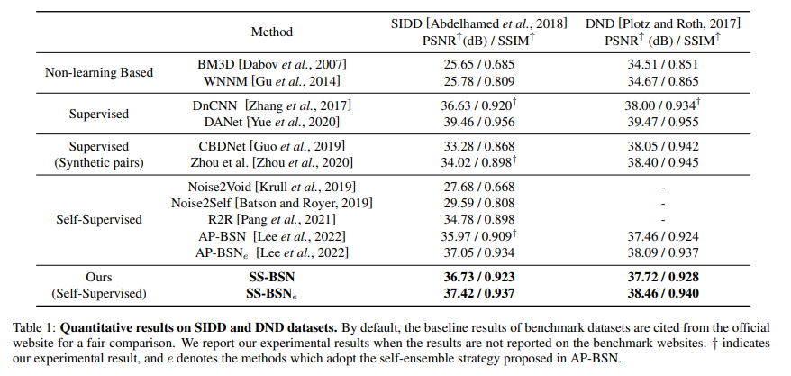
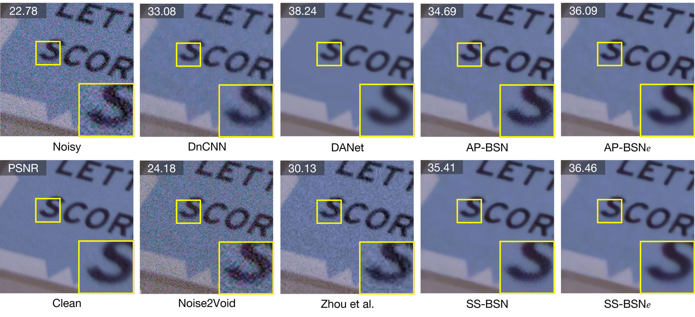

# SS-BSN: Attentive Blind-Spot Network for Self-Supervised Denoising with Nonlocal Self-Similarity
Young-Joo Han and Ha-Jin Yu, "SS-BSN: Attentive Blind-Spot Network for Self-Supervised Denoising with Nonlocal Self-Similarity", IJCAI, 2023.

---
## Abstract
Recently, numerous studies have been conducted on supervised learning-based image denoising methods. However, these methods rely on large-scale noisy-clean image pairs, which are difficult to obtain in practice. Denoising methods with self-supervised training that can be trained with only noisy images have been proposed to address the limitation. These methods are based on the convolutional neural network (CNN) and have shown promising performance. However, CNN-based methods do not consider using nonlocal self-similarities essential in the traditional method, which can cause performance limitations. This paper presents self-similarity attention (SS-Attention), a novel self-attention module that can capture nonlocal self-similarities to solve the problem. We focus on designing a lightweight self-attention module in a pixel-wise manner, which is nearly impossible to implement using the classic self-attention module due to the quadratically increasing complexity with spatial resolution. Furthermore, we integrate SS-Attention into the blind-spot network called self-similarity-based blind-spot network (SS-BSN). We conduct the experiments on real-world image denoising tasks. The proposed method quantitatively and qualitatively outperforms state-of-the-art methods in self-supervised denoising on the Smartphone Image Denoising Dataset (SIDD) and Darmstadt Noise Dataset (DND) benchmark datasets.

----
## Requirements
- Python 3.11.3
- PyTorch 2.0.1
- OpenCV 4.7.0.72
- Numpy 1.24.1
- Einops 0.6.1
- Scikit-image 0.20.0
- tqdm 4.65.0

---
## Dataset
This project follows the dataset structure of AP-BSN. You can confirm it through the following link. [Link](https://github.com/wooseoklee4/AP-BSN/blob/master/src/datahandler/prepare_dataset.md)

---
## Train Your Model
```
usage: python train.py [-c CONFIG_FILE_NAME] [-g GPU_NUM] 
                       [-s SESSION_NAME] [-r] [--thread THREAD_NUM]

Train model.

Arguments:      
  -c CONFIG_FILE_NAME              Configuration file name. (only file name in ./conf, w/o '.yaml') 
  -g GPU_NUM                       GPU ID(number). Only support single gpu setting.
  -s SESSION_NAME      (optional)  Name of training session (default: configuration file name)
  -r                   (optional)  Flag for resume training. (On: resume, Off: starts from scratch)
  --thread THREAD_NUM  (optional)  Number of thread for dataloader. (default: 4)
```


Example: Train our method for the SIDD dataset using gpu:0
```
python train.py -s {model_name} -c SSBSN_SIDD -g '0'
```

---
## Test Pretrained Model
Please download the model trained on SIDD medium from this [link](https://drive.google.com/file/d/1nZ-bc-4H8DtTj6LDN-vQrTowcaUqYDpn/view?usp=share_link). Put it in path:
```
/ckpt/SSBSN_SIDD.pth
```


(Pretrained models for other datasets will be added later.)

```
usage: python test.py [-c CONFIG_FILE_NAME] [-g GPU_NUM] 
(model select)        [-e CKPT_EPOCH] [--pretrained MODEL] 
                      [-s SESSION_NAME] [--thread THREAD_NUM] [--test_img IMAGE] [--test_dir DIR]

Test dataset or a image using pre-trained model.

Arguments:      
  -c CONFIG_FILE_NAME              Configuration file name. (only file name in ./conf, w/o '.yaml') 
  -g GPU_NUM                       GPU ID(number). Only support single gpu setting.
  -e CKPT_EPOCH                    Epoch number of checkpoint. (disabled when --pretrained is on)
  --pretrained MODEL   (optional)  Explicit directory of pre-trained model in ckpt folder.
  -s SESSION_NAME      (optional)  Name of training session (default: configuration file name)
  --thread THREAD_NUM  (optional)  Number of thread for dataloader. (default: 4)
  --test_img IMAGE     (optional)  Image directory to denoise a single image. (default: test dataset in config file)
  --test_dir DIR       (optional)  Directory of images to denoise.
```

Example: Test our method with pretrained model for the SIDD validation dataset using gpu:0
```
python test.py -c SSBSN_SIDD --pretrained SSBSN_SIDD.pth -g 0
```

---
## Results
Please refer our paper for more detailed results.

### Quantitative Results (SIDD Benchmark, DND Benchmark)


### Qualitative Results (SIDD Validation)



---
## Acknowledgement

The codes are based on [AP-BSN](https://github.com/wooseoklee4/AP-BSN). Thanks for the great works.
